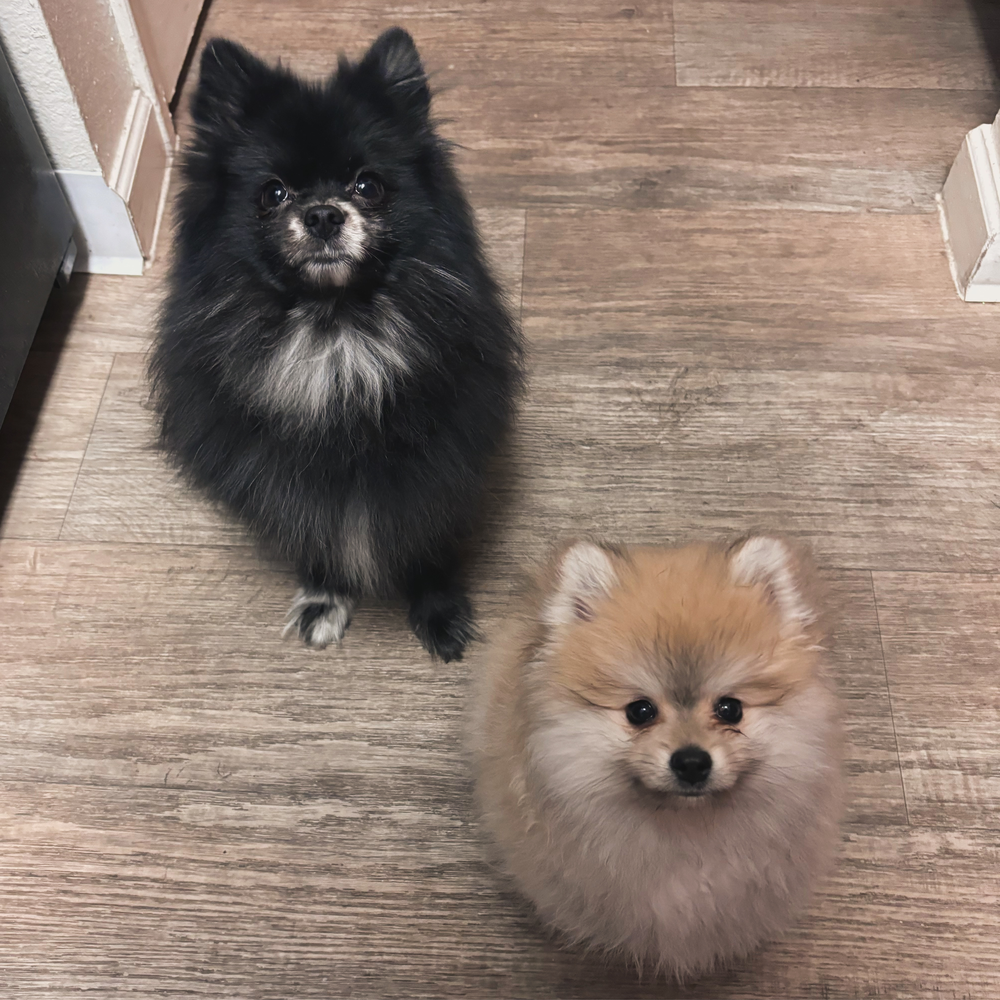

On the occasion, I like to make blog posts about *fun with statistics* that are geared to spreading statistical knowledge in a fun way. For the better part, most of the blog posts will discuss methods for social network analysis. Please feel free to reach out if you have any questions or if you notice any errors.

::: {style="display: flex; align-items: flex-start;"}
<!-- Left Section: Image and Details -->

::: {style="flex: 0 0 200px; text-align: center; margin-right: 40px;"}
### [](teaching_posts/fun_with_stats_logistic_regression.html){style="width: 100%; max-width: 200px; border-radius: 5px; margin-bottom: 15px; border: 4px solid orange;"}
:::

<!-- Right Section: Descriptive Text -->

::: {style="flex: 1; background: none; border: none;"}
### [Fun With Statistics: Logistic Regression](teaching_posts/fun_with_stats_logistic_regression.html)

```         
- A brief discussion of the ordinary least squares estimator.
- A brief discussion of maximum likelihood estimation.
- A discussion of the logistic regression via maximum likelihood estimation.
- A replication of "by-hand" logistic function and the stats::glm function.
```
:::
:::
